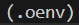
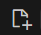
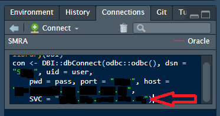

This repo will allow you to connect to an Oracle database at PHS using VSCode. Oracle is used for databases such as SMRA.
Clone this repo in order to have the required files in your VSCode environment.

# Prepare your VScode
If you have never used VSCode, check the link under references on how to prepare it.

1. Run the bash script from the terminal (only the first time you use VSCode)
```
bash install_extensions.sh
```
# Prepare your Python environemnt (Python 3.12.6) (for other Python versions check reference link)
1. Create your environment (only the first time you create the project). To create an environment called .oenv, run:
```
/opt/python/3.12.6/bin/python3.12 -m venv .oenv
```
2. Activate this environment using this command in terminal (each time you open your project)
```
source .oenv/bin/activate
```
 Make sure your env name appears at the start of the line in the terminal. 

3. Update your pip (only the first time you create your environment)
```
pip install --upgrade pip wheel
```
4. Install required packages (only the first time you create your environment)
```
pip install -r requirements.txt
```
5. Create a .env file (environment variables)
```
touch .env
```
Alternatively, VSCode has an icon to create files at the top of the list of folders:  

6. Run the following to save your username, password and DSN into the .env file. 

🔴**Caution**: *Do not store your credentials in plain text or as part of your code (hardcoded).*

Note: for SMRA, the DSN URL is something like SMRA.xxx.xxxx.xxx.xx
You can find the DSN URL by connecting to the database on R and checking the SVC variable under Connections: 


```
ORACLE_USER=your_user_name
ORACLE_PASSWORD=your_password
ORACLE_DSN=your_dns_url
```
7. Run this code to change the permissions in your .env file (to ensure it is readable and writeable only for you):
```
chmod 600 .env
```
8. Run the demo python script through the terminal for a quick test of pulling data (you will see a table in terminal):
```
python demo.py
```

The script my_db.py contains a Python class which facilitates the connection to Oracle and retrieves data in a pandas dataframe. Call my_oracle_object.query_to_df and set an sql statement in the sql argument to get a pandas dataframe.

# References

For more Python/vscode info: https://github.com/Public-Health-Scotland/vscode_prep
